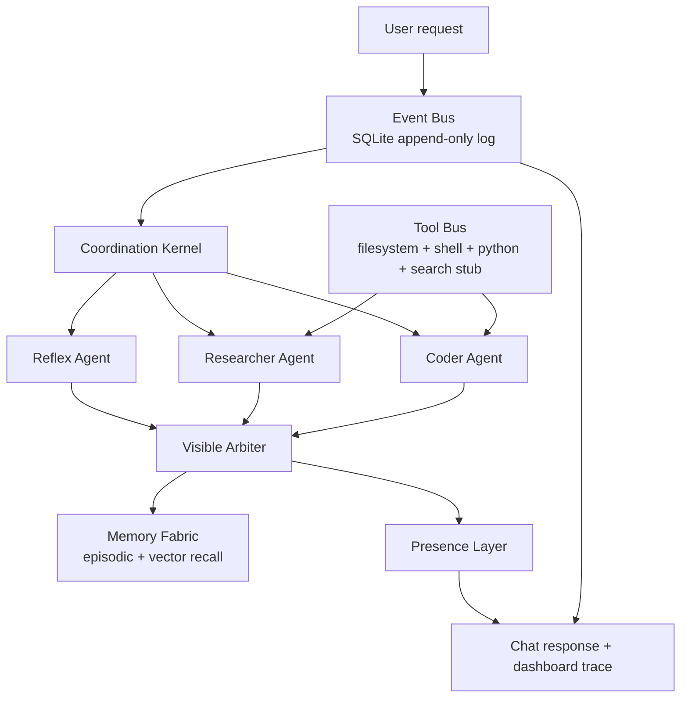

# OmniBot v0.1 "Hello Coherence"

OmniBot v0.1 proves one narrow thesis:

> Parallel agents + explicit arbitration + memory + provenance = one coherent collaborator, not a swarm.

This is not a full framework. It is a small coordination substrate with an append-only event log, three starter agents, a visible arbiter, minimal memory, scoped tools, and chat/dashboard surfaces.

## Run

```bash
python -m venv .venv
.venv\Scripts\activate
pip install -e .[dev]
```

Optional local model:

```bash
ollama pull llama3.2
ollama serve
```

The prototype runs without Ollama by using deterministic fallback logic.

CLI demo:

```bash
python main.py ask "Look at the file test.py and tell me why the tests are failing, then propose a fix."
```

Web API + dashboard:

```bash
python main.py web --port 8000
```

Then open:

- `POST http://127.0.0.1:8000/chat`
- `GET http://127.0.0.1:8000/api/events`
- `GET http://127.0.0.1:8000/api/memory`

Optional Gradio surface:

```bash
python main.py gradio
```

## Architecture



## What Was Cherry-Picked From Forge

The code is fresh, but these patterns were adapted from Grok-Party-Pack:

- lazy tool categories and sandbox checks from `forge/tools/registry.py`
- filesystem/shell/python tool behavior from `forge/tools/*`
- dangerous command and sensitive path guardrails from `forge/guardrails.py`
- task lifecycle/audit thinking from `forge/task_state.py`
- context/memory concepts from `forge/context_engine.py`

The Forge council, arena, Flask UI, trading, toll, and xAI-specific planner were intentionally left out.

## End-To-End Trace

User sees:

```text
I treated this as: Intent: debug/code assistance. Referenced paths: test.py.

What I found:
- test.py:
  def add(a, b):
      return a - b
  ...
- pytest result:
  returncode=1
  stdout=...

Proposed next move:
Use the test output and referenced file content above as the fix target.

What I did:
- Ran 3 agents in parallel: reflex, researcher, coder.
- Used tools: read_file, run_command, web_search.
- Sources: test.py, tool:python -m pytest -q, tool:web_search.
- Arbiter confidence: 0.80.

Why this answer:
Selected coder, reflex because they provided the strongest combination of direct evidence, tool use, and task classification.
```

Internally, the event log records:

```text
user.requested
task.created
task.status queued/thinking/working/done
agent.started x3
tool.called / tool.completed
agent.completed x3
arbiter.decided
memory.written
presence.responded
```

Every row includes causal parents, payload, provenance, and an audit hash.

## Tests

```bash
pytest
```

The golden test creates a broken `test.py`, asks the demo prompt, and asserts that the loop records three agent completions, an arbiter decision, a memory write, and a composed response.

## v0.1 Boundaries

- `web_search` is a stub.
- The coder proposes; it does not edit files automatically.
- The arbiter is heuristic, visible, and event-logged.
- Memory uses `sentence-transformers` when available and a hash fallback otherwise.
- The dashboard is intentionally API-first; a polished UI can sit on the same trace.
