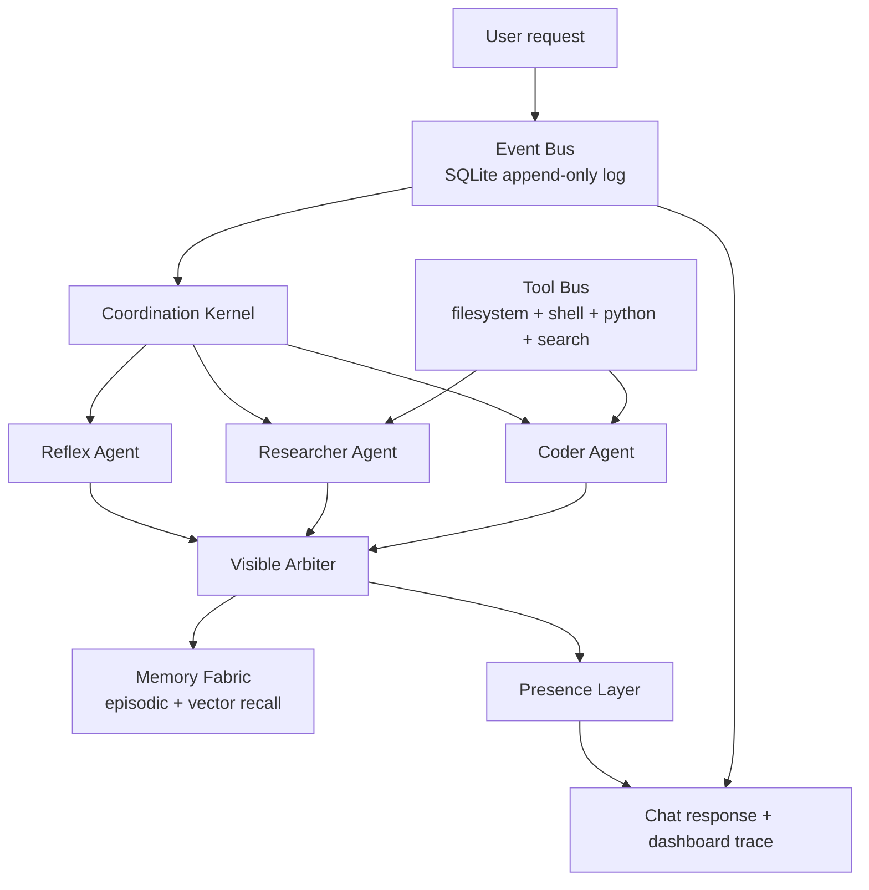

# OmniBot v0.1.7 "Trace Polish"

OmniBot v0.1.7 proves one narrow thesis:

> Parallel agents + explicit arbitration + memory + provenance = one coherent collaborator, not a swarm.

This is not a full framework. It is a small coordination substrate with an append-only event log, three starter agents, a visible arbiter, minimal memory, scoped tools, patch artifacts, and a dashboard that makes the coherence loop feel inspectable and deliberate.

## Run

```bash
python -m venv .venv
.\.venv\Scripts\Activate.ps1
pip install -e .[dev]
```

If PowerShell blocks activation, either run once:

```powershell
Set-ExecutionPolicy -Scope CurrentUser RemoteSigned
```

or skip activation and call the venv Python directly:

```powershell
.\.venv\Scripts\python.exe -m pip install -e ".[dev]"
.\.venv\Scripts\python.exe main.py web --port 8000 --workspace .
```

Primary model setup:

```bash
copy .env.example .env
```

Then edit `.env` and set:

```bash
XAI_API_KEY=your_xai_key_here
OMNIBOT_PROVIDER=xai
OMNIBOT_MODEL=grok-4.3
```

Optional local fallback:

```bash
ollama pull llama3.2
ollama serve
```

The prototype defaults to xAI `grok-4.3`. If `XAI_API_KEY` is missing or the API call fails, it tries LM Studio, then Ollama, then deterministic fallback logic.

If you use LM Studio locally, start the LM Studio server and set:

```bash
OMNIBOT_PROVIDER=lmstudio
OMNIBOT_LMSTUDIO_MODEL=your-loaded-model-id
LMSTUDIO_BASE_URL=http://localhost:1234/v1
```

You can also leave `OMNIBOT_PROVIDER=xai`; OmniBot will try xAI first, then LM Studio, then Ollama, then deterministic fallback.

Browser demo:

```bash
python main.py web --port 8000 --workspace .
```

Then open `http://127.0.0.1:8000/dashboard`, use the Request Console, and the trace will load on the same page.

CLI demo:

```bash
python main.py ask "Look at the file examples/broken_test/test.py and tell me why the tests are failing, then propose a fix." --workspace .
```

Web API + dashboard:

```bash
python main.py web --port 8000
```

Then open:

- `POST http://127.0.0.1:8000/chat`
- `GET http://127.0.0.1:8000/dashboard`
- `GET http://127.0.0.1:8000/api/events`
- `GET http://127.0.0.1:8000/api/traces`
- `GET http://127.0.0.1:8000/api/memory`

Optional Gradio surface:

```bash
python main.py gradio
```

## Architecture



## v0.1.1 Adds

- Real `/dashboard` page for the full trace.
- `CoherenceScore` with evidence coverage, agent agreement, tool provenance, confidence spread, unresolved risk, and overall score.
- Coder-produced unified diff artifacts for obvious demo failures. They are never applied automatically.
- Pluggable web search tool: Tavily, Brave, then DuckDuckGo Instant Answer fallback.
- CLI flags can appear after the subcommand: `python main.py ask "..." --workspace .`.
- Golden tests for causal parent visibility and audit hash validation.
- `examples/broken_test/test.py` so the README demo works in a fresh clone.

## v0.1.2 Adds

- Redesigned `/dashboard` as **Beautiful Trace**, a dark atmospheric coordination log.
- Latest trace loads first, with recent trace selection.
- Coherence score is shown as a prominent stat sheet with color-coded bars.
- Arbiter decision is elevated with a high-score golden glow and a "Why this answer?" toggle.
- Agent execution, tool calls, patch artifacts, causal chain, and memory writes now each have dedicated, glanceable sections.
- Chat presence output keeps the same facts while aligning the wording with the trace/dashboard language.

## v0.1.3 Adds

- xAI is now the primary model provider path.
- Default model is `grok-4.3`.
- `.env` loading is supported via `python-dotenv`.
- `.env.example` documents xAI, Ollama fallback, and optional search provider keys.

## v0.1.4 Adds

- LM Studio support through its OpenAI-compatible `/v1/chat/completions` API.
- Local fallback order is now LM Studio first, then Ollama.
- `OMNIBOT_PROVIDER=lmstudio` runs local-first.
- `.env.example` includes `LMSTUDIO_BASE_URL`, `OMNIBOT_LMSTUDIO_MODEL`, and optional `LMSTUDIO_API_KEY`.

## v0.1.5 Adds

- Default install is lightweight: no Gradio, Torch, Transformers, or sentence-transformers unless requested.
- `sentence-transformers` moved to the optional `embeddings` extra.
- Gradio moved to the optional `gradio` extra.
- Python support lowered to `>=3.10` to match the current Windows dev environment.

## v0.1.6 Adds

- Native Request Console on `/dashboard`.
- Submitting from the dashboard calls `/chat`, waits for the run, refreshes traces, and selects the new task automatically.
- Gradio is now purely optional; the main browser experience is the custom FastAPI dashboard.

## v0.1.7 Adds

- More spacious Beautiful Trace layout with stronger hierarchy.
- Agent and tool cards now show curated summaries first, with raw output behind expansion.
- Causal chain is now a six-stage spell path: Invocation, Agents, Tools, Judgment, Memory, Response.
- Full audit hash/parent event ledger remains available under the causal chain.

## What Was Cherry-Picked From Forge

The code is fresh, but these patterns were adapted from Grok-Party-Pack:

- lazy tool categories and sandbox checks from `forge/tools/registry.py`
- filesystem/shell/python tool behavior from `forge/tools/*`
- dangerous command and sensitive path guardrails from `forge/guardrails.py`
- task lifecycle/audit thinking from `forge/task_state.py`
- context/memory concepts from `forge/context_engine.py`

The Forge council, arena, Flask UI, trading, toll, and xAI-specific planner were intentionally left out.

## End-To-End Trace

User sees:

```text
I treated this as: Intent: debug/code assistance. Referenced paths: test.py.

What I found:
- test.py:
  def add(a, b):
          return a - b
  ...
- pytest result:
  returncode=1
  stdout=...

Proposed next move:
I produced 1 proposed patch artifact as a unified diff. It is not applied automatically.

What I did:
- Ran 3 agents in parallel: reflex, researcher, coder.
- Used tools: read_file, run_command, web_search.
- Sources: test.py, tool:python -m pytest -q, tool:web_search.
- Arbiter confidence: 0.80.

Coherence score:
- Overall: 0.75
- Evidence coverage: 1.00
- Agent agreement: 0.45
- Tool provenance: 1.00
- Confidence spread: 0.60
- Unresolved risk: 0.15

Why this answer:
Selected coder, reflex because they provided the strongest combination of direct evidence, tool use, and task classification.
```

Internally, the event log records:

```text
user.requested
task.created
task.status queued/thinking/working/done
agent.started x3
tool.called / tool.completed
artifact.created
agent.completed x3
arbiter.decided
memory.written
presence.responded
```

Every row includes causal parents, payload, provenance, and an audit hash.

## Tests

```bash
pytest
```

The golden tests create a broken `test.py`, ask the demo prompt, and assert that the loop records three agent completions, a patch artifact, an arbiter decision, a memory write, valid audit hashes, resolvable causal parents, and a composed response.

## v0.1.1 Boundaries

- `web_search` is intentionally minimal; configure `TAVILY_API_KEY` or `BRAVE_SEARCH_API_KEY` for stronger results.
- The coder proposes; it does not edit files automatically.
- The arbiter is heuristic, scored, visible, and event-logged.
- Memory uses `sentence-transformers` when available and a hash fallback otherwise.
- The dashboard is intentionally simple; a richer UI can sit on the same trace APIs.
